[](https://travis-ci.com/IBM/elasticsearch-chatbot)

# Elasticsearch Chatbot

In this Code Pattern, we will create a chatbot using Watson Assistant, Elasticsearch, and Node.js on Cloud Foundry. This chatbot works with TV shows by making recommendations and providing show information.

# Architecture

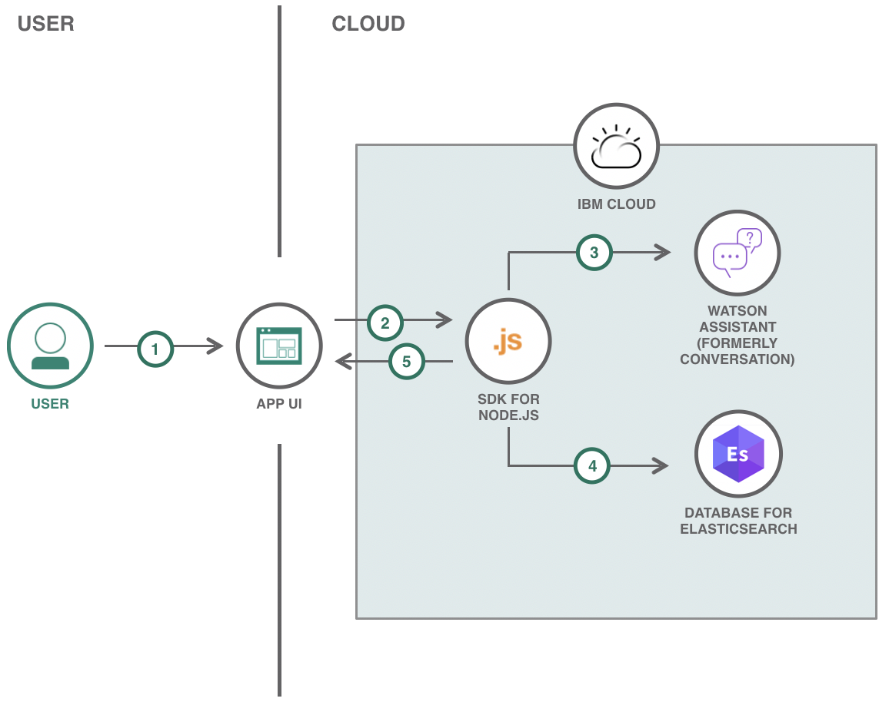

1. User interacts with chatbot from the React UI by asking question via text.
2. React UI sends User's message to the Node.js backend on Cloud Foundry. 
3. The Node.js backend sends the message to Watson Assistant to determine the intent and entities of the User's message.
4. The Node.js backend querys the Elasticsearch database based on the intents and entities processed by Watson Assistant.
5. The response and results are sent to the React UI.

# Steps

Follow these steps to setup and run this code pattern on the Cloud. The steps are described in detail below.

1. [Clone the repo](#1-clone-the-repo)
2. [Prerequisites](#2-prerequisites)
3. [Deploy to IBM Cloud](#3-deploy-to-ibm-cloud)

## 1. Clone the repo

Clone the `elasticsearch-chatbot` repo locally. In a terminal, run:

```bash
git clone https://github.com/IBM/elasticsearch-chatbot
cd elasticsearch-chatbot
```

## 2. Prerequisites

* [IBM Cloud account](https://cloud.ibm.com/registration)
* [IBM Cloud CLI](https://cloud.ibm.com/docs/cli?topic=cloud-cli-ibmcloud-cli&locale=en-US#overview)
* [NodeJS](https://nodejs.org/en/download/)
* [NPM](https://www.npmjs.com/get-npm)
* Relevant Node Components: Use `npm install` in `/app` and `/web`

## 3. Deploy to IBM Cloud

1. Provision two [SDK for Node.js](https://cloud.ibm.com/catalog/starters/sdk-for-nodejs) applications. One will be for `./app` and the other will be for `./web`.

2. Provision a [Database for Elasticsearch](https://cloud.ibm.com/catalog/services/databases-for-elasticsearch).

3. Provision a [Watson Assistant](https://cloud.ibm.com/catalog/services/watson-assistant).

4. Import the Skill data from `skill-TV-Shows.json` to your instance of Watson Assistant. Create an Assistant that incorporates the `TV Shows` skill.

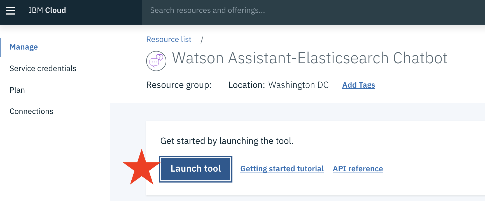

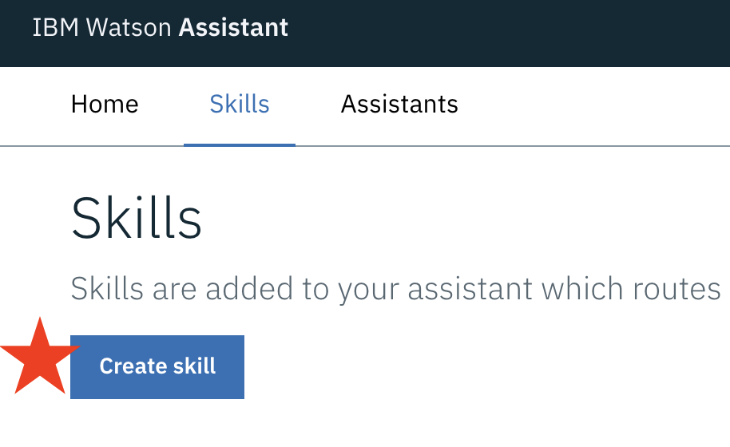

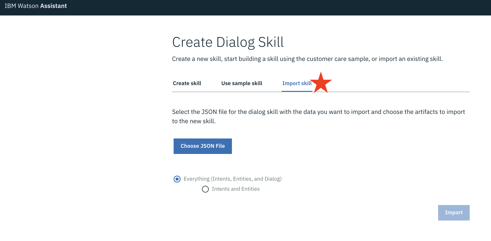

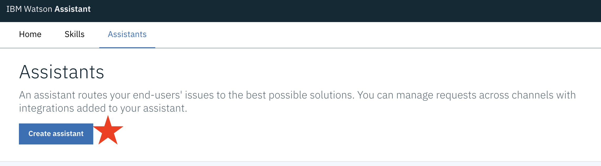

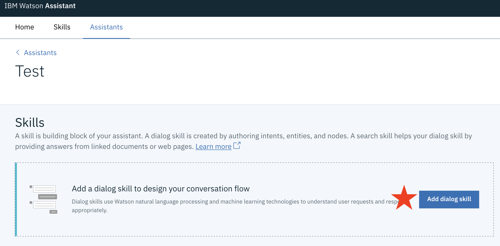

5. Create Service Credentials for the Elasticsearch Database.

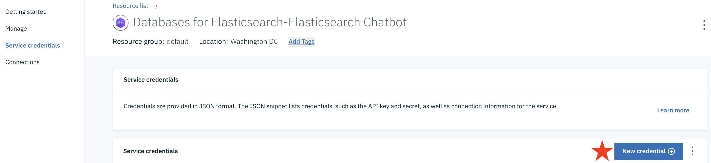

6. Connect the Elasticsearch Database and Watson Assistant with the Node.js app by going to *Connections* on the dashboard of the app provisioned and clicking *Create Connection*. Locate the Elasticsearch Database and Watson Assistant you provisioned and press *connect*.


7. Update `REACT_APP_API_BASE_URL` in `./web/.env` to `https://<APP-NAME>.<APP-DOMAIN>`

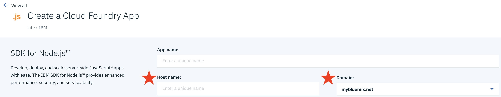

8. From the `./web` directory, run `npm run build` so that the React front end can be run on Cloud Foundry with a static buildpack.

9. Update the following in the [manifest.yml](manifest.yml) file:

* `name` for both Cloud Foundry application names provisioned from Step 1.

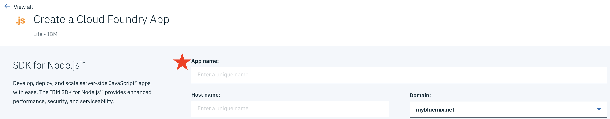

* `services` with the name of the Elasticsearch Database and Watson Assistant services provisioned from Steps 2 and 3.

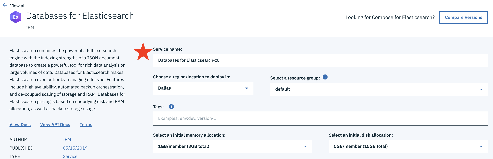

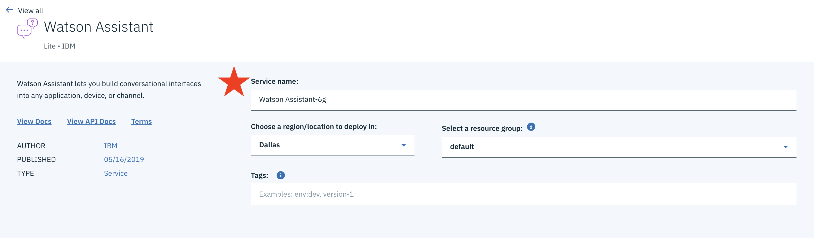

* `ELASTIC_BASE_URL` with the `connection -> https -> composed` URL from your generated Service Credentials from the Elasticsearch Database.


* `WATSON_USERNAME` with the username of the Service Credentials of your Assistant of Watson Assistant.

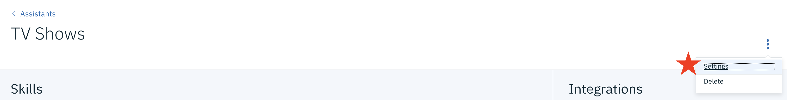

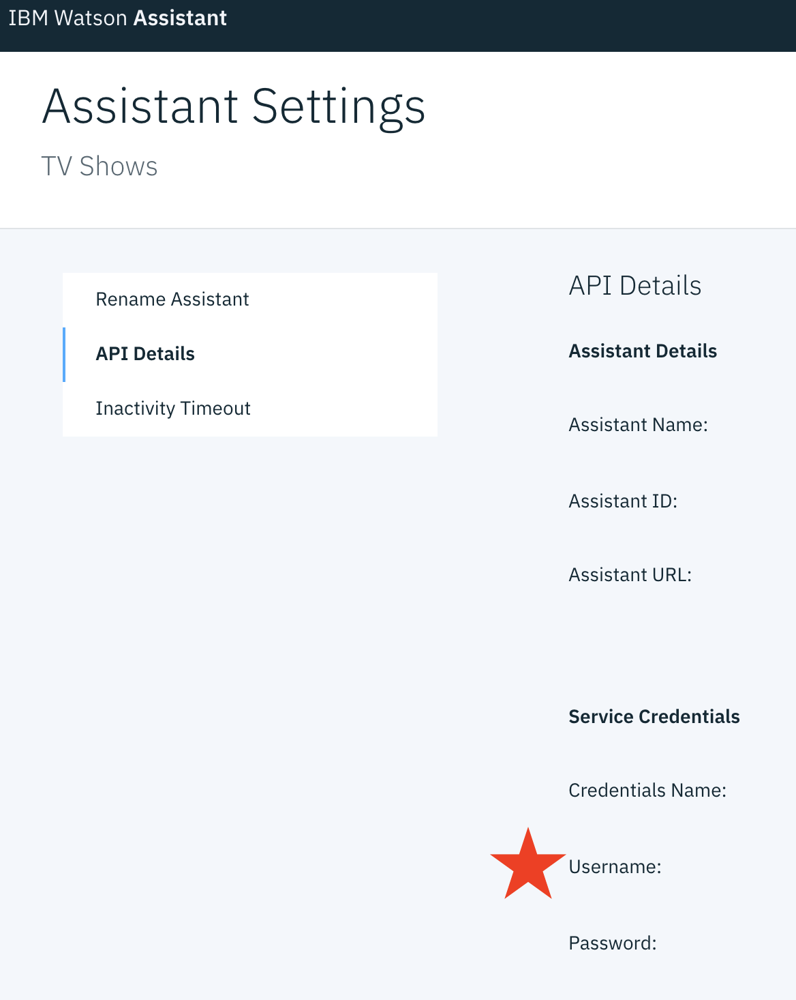

* `WATSON_PASSWORD` with the password of the Service Credentials of your Assistant of Watson Assistant.

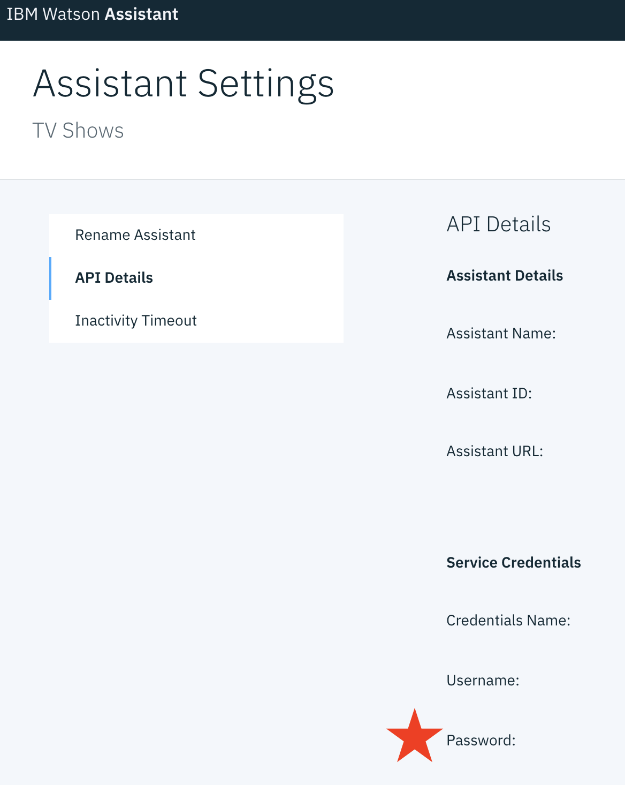

* `WATSON_API_URL` with the assistant URL of the Assistant Details of your Assistant of Watson Assistant.
> NOTE: Only include the part of the URL up to and including `/api` 
 
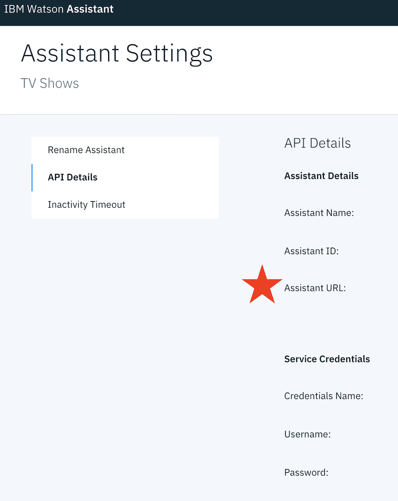

* `WATSON_ASSISTANT_ID` with the assistant ID of the Assistant Details of your Assistant of Watson Assistant.

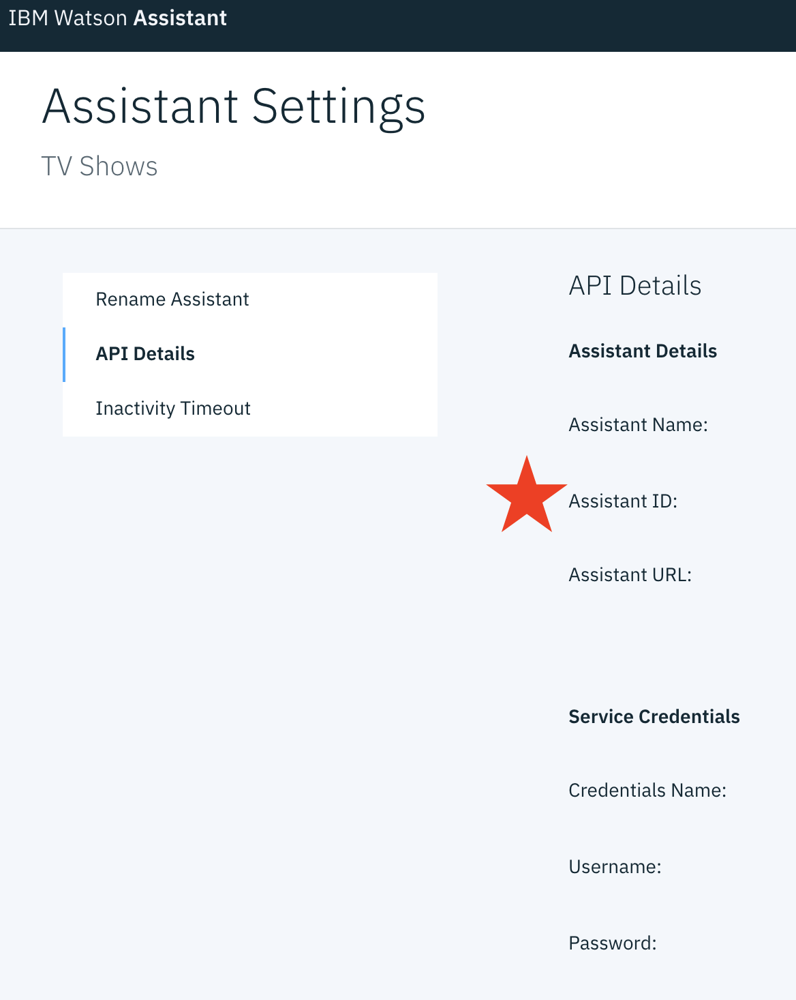

10. To deploy the services to IBM Cloud Foundry, go to one of the dashboards of the apps provisioned from Step 1 and follow the *Getting Started* instructions for connecting and logging in to IBM Cloud from the console (Step 3 of *Getting Started*). Once logged in, run `ibmcloud app push` from the root directory.

11. Use `https://<WEB-NAME>.<WEB-DOMAIN>` to access the React UI.

# License

This code pattern is licensed under the Apache License, Version 2. Separate third-party code objects invoked within this code pattern are licensed by their respective providers pursuant to their own separate licenses. Contributions are subject to the [Developer Certificate of Origin, Version 1.1](https://developercertificate.org/) and the [Apache License, Version 2](https://www.apache.org/licenses/LICENSE-2.0.txt).

[Apache License FAQ](https://www.apache.org/foundation/license-faq.html#WhatDoesItMEAN)
